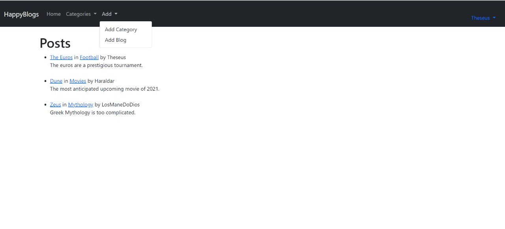
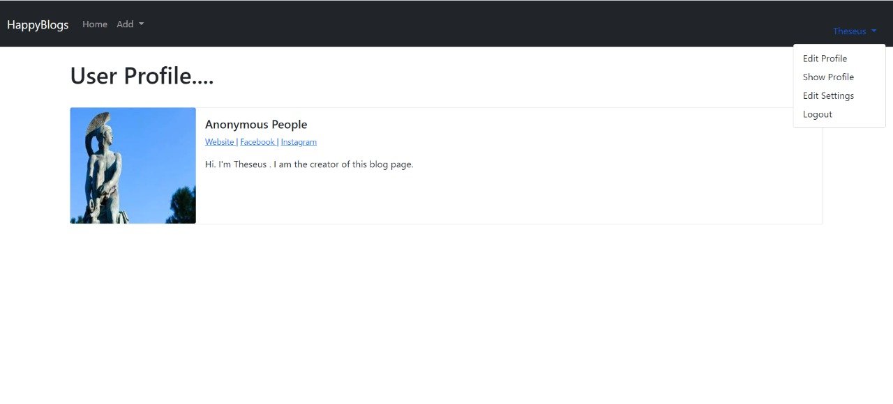

# HappyBlog

A simple blog page which allows users to add,edit and manage blogposts as well as like and comment for registered and unregistered users. Each blogpage writer also has his/her profile page complete with social media handles and webpages. 

## Features
### Unregistered Users
- Can view and comment on blog posts.
### Registered Users
- Can add blog posts and blog categories
- Can edit and delete their own blog posts.
- Can like and dislike blog posts
- Can view author profile pages
- Can edit their own profile pages
- Can change their user login passwords.

## How to run:

Download or clone the repo. Download or update to the latest version of python and in the command prompt run the following command

```
pip install -r requirements.txt
```
After this change directory to ggblog and run the following command
```
python manage.py runserver
```
If it gives an error run
```
python manage.py makemigration
```
```
python manage.py migrate
```
and then run again
```
python manage.py runserver
```

## Tech Stack:

- Django Framework
- HTML and Bootstrap for frontend
- Pillow to store and manage image field
- SQLite database for entries

## Screenshots


